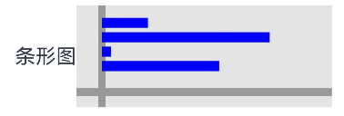
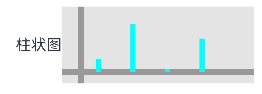
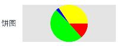
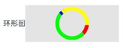

# lite_chart

## 项目介绍

项目名称：lite_chart

仓库地址：[https://atomgit.com/so_love_bang/LiteChart](https://atomgit.com/so_love_bang/LiteChart)

安装方式：

```
ohpm install lite_chart
```

服务编译时的版本： API10

服务兼容的最低版本： API9

安装方式：ohpm install lite_chart


> lite_chart是一款轻量的图表绘制工具。
>
> 它可以使用非常少的代码绘制出漂亮的折线图、曲线图等图形样式。
> 源代码少、调用方便。
>
> 非常适合初学者了解和学习Canvas 以及帮助刚学习鸿蒙的小白快速的绘制心仪的图表。
>


### 设备支持情况

| 开发板          | CPU内核架构 | 系统                   | API | 测试时间       |
|--------------|---------|----------------------|-----|------------|
| DAYU200      | ARM     | OpenHarmony 3.2.15.2 | 9   | 2023-10-19 |
| DAYU800      | RISC-V  | HiHopeOS V2          | 9   | 2023-10-19 |
| Purple-Pi-Oh | ARM     | OpenHarmony 3.2.11.9 | 9   | 2023-10-19 |

### 开发工具支持情况

| 开发工具                | 构建版本      | 测试时间       |
|---------------------|-----------|------------|
| DevEco Studio 4.0 Release | 4.0.0.600 | 2023-11-01 |

### 作者

项目发起作者：刘张豪

## 演示项目图

演示项目源码：https://atomgit.com/so_love_bang/transactions

## 使用思路：


> lite_chart 遵循 all in one 的设计思路。
>
> 所有的图表显示只需要修改 lite_chart 的属性即可修改显示图形的样式。
>
> 使用约定 大于 配置的设计思路。
>
> 如果不加以配置所显示图表的长度，那么默认显示所传入 linesDatas 的值


### 相关模块导入

#### 导包

```typescript
import { LiteChart } from 'lite_chart'
```

#### 数据初始化

```
  @State linesDatas: number[] = [20, 73, 4, 51];
```

 
### 折线图

> 通过修改绘制内容来显示折线图

```typescript
LiteChart({
  values: $linesDatas,
  axisStyle: "#999999",
  linesStyle: "#000000",
})
  .backgroundColor("#4999")
  .width(200)
  .height(80)
```


### 曲线图

> 通过修改绘制内容来显示曲线图

```typescript
// 
LiteChart({
  values: $linesDatas,
  axisStyle: "#999",
  graphStyle: "#f00",
})
  .backgroundColor("#4999")
  .width(200)
  .height(80)
```


### 条形图

> 通过修改绘制内容来显示条形图

```typescript
 LiteChart({
  values: $linesDatas,
  axisStyle: "#999",
  barChartStyle: "#00f",
})
  .backgroundColor("#4999")
  .width(200)
  .height(80)
```



### 柱状图演示样式

> 通过修改绘制内容来显示柱状图

```typescript
LiteChart({
  values: $linesDatas,
  axisStyle: "#999",
  histogramStyle: "#0ff",
})
    .backgroundColor("#4999")
    .width(200)
    .height(80)
```




### 饼图演示样式

> 通过修改绘制内容来显示饼图

```typescript
LiteChart({
  values: $linesDatas,
  pieChartStyle: ["#f00", "#0f0", "#00f", "#ff0"]
})
  .backgroundColor("#4999")
  .width(200)
  .height(80)
```




### 环形图演示样式

> 通过修改绘制内容来显示环形图

```typescript
LiteChart({
values: $linesDatas,
    ringWidth:8,
    ringChartStyle: ["#f00", "#0f0", "#00f", "#ff0"]
})
    .backgroundColor("#4999")
    .width(200)
    .height(80)
```




贡献代码
使用过程中发现任何问题都可以提Issue 给我们，当然，我们也非常欢迎你给我们提PR 。

开源协议
本项目基于 Apache 2.0 ，请自由地享受和参与开源。


